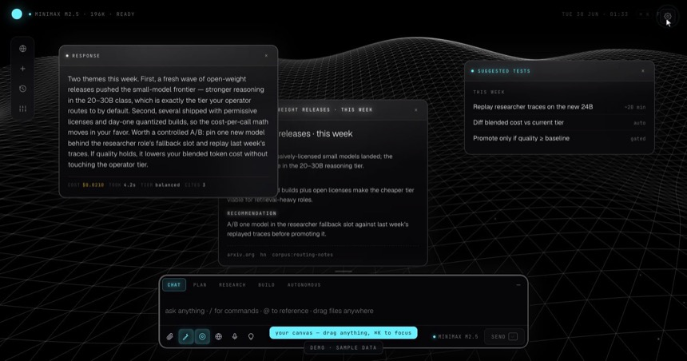
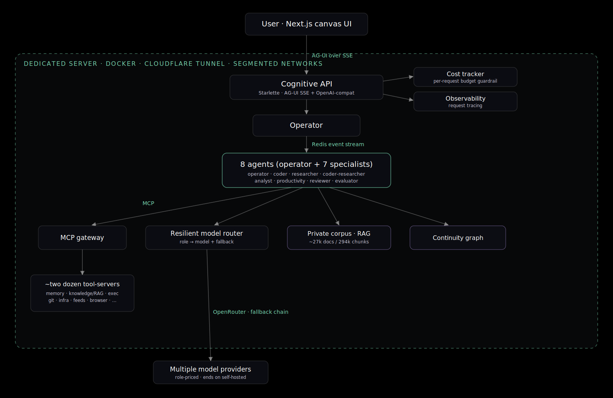
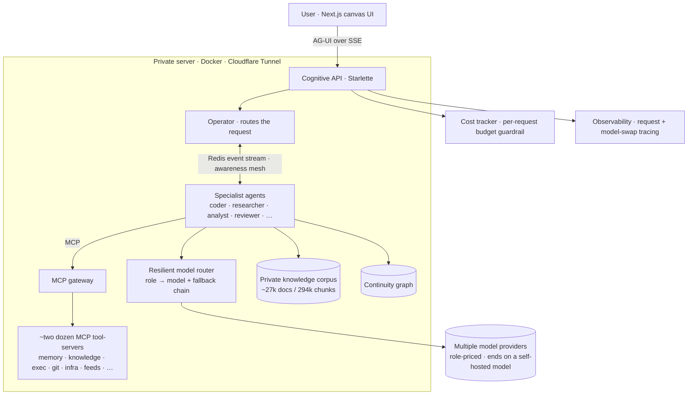

# Pacific Slate: a personal AI system

Pacific Slate is a personal AI system that works over my own knowledge and the sources I follow, and does useful work in the background instead of only answering when asked.

It runs on a private remote server, remembers context across sessions, and is built from specialized agents I route work to. This page is a plain overview: *what it is, how it's put together, and how it handles privacy*. Technical details are at the end if interested.

Up front: I'm an operator and systems architect, not a career software engineer. I designed the architecture, made the model-routing, reliability, and cost decisions, and built it AI-natively, in partnership with a range of AI platforms, agents, and coding tools.

**What it does for me, day to day.** It keeps itself current on my world. Whatever's wired in electronically (mail, calendar, messages, the feeds and accounts I follow) flows in on its own, so it already knows the state of play when I ask. It puts current events to work on ordinary tasks: a heads-up before a meeting, a standing watch on something I care about, the daily admin that usually eats an afternoon. And I reach all of it from a normal Claude client over a standard MCP connection — the same assistant I already use, now backed by my own memory, data, and tools.

---

## ▶ Live demo

**[pacslate.com/demo](https://pacslate.com/demo)** — the real UI, running on fabricated **sample data** with no private backend.

- **Canvas** — issue a prompt (or watch the autoplay): the operator routes to specialist agents, streams a synthesized answer, and spawns result cards, each tagged with the model that served it and what the call cost. → **[open the canvas](https://pacslate.com/demo)**
- **Monitor** — a world dashboard. In the demo, USGS seismic and a public headline feed (HackerNews) run live, fetched client-side; markets, aircraft, and the personal layer are clearly-labeled sample data. (In production the headline feed is wire-service RSS and the market/flight feeds are live.) → **[open the monitor](https://pacslate.com/demo/#monitor)**

*The personal layer is sample data and there's no private backend; the production system is private by design.*

<video src="docs/demo-canvas.mp4" poster="docs/demo-canvas-poster.jpg" autoplay muted loop playsinline preload="metadata" style="width:100%;border:1px solid rgba(255,255,255,0.10);border-radius:10px;display:block;margin:14px 0">
  
</video>

*The canvas (sample data) — the agent's answer streams in as movable result cards, each tagged with the model that served it and the call's cost. The pointer is a one-time guided preview: it drags a card and re-themes the workspace, then hands control back the moment you move the mouse or type.*

*The monitor — USGS seismic and a public headline feed run live (client-side); markets, aircraft, and the personal layer are sample data.*

---

## Why I built it

The frontier chat tools I was using didn't hold context across sessions the way I wanted, filtered at the output layer, and kept my data on their side. I wanted something that was mine end to end: runs continuously, remembers what matters, reasons over my own knowledge, and pushes useful things to me instead of waiting to be asked.

The harder part: take a lot of noisy, scattered input (my own notes and documents, the feeds and sources I care about) and turn it into something **verified and actionable** instead of just another summary.

One design choice shaped the rest: the model is the part I don't own, so I built the system so it's the part I can swap. The durable pieces — my data, the memory, the tools, the routing and orchestration logic — are mine and stay put; the model is rented, reached over standard interfaces, so moving to a better one (or another provider) is mostly a config change rather than a rebuild. Day to day I drive it through Claude Code, but the design doesn't depend on that.

## What it's made of

A plain-language tour of the pieces:

- **A multi-agent core.** An operator reads a request and routes it to the right specialist — research, coding, analysis, review, and a few others — each backed by the model best suited (and priced) for its job, with automatic ranked fallback across vendors so one model going down doesn't stop the run.
- **A tool layer.** Roughly two dozen tool-servers the agents can call (over the Model Context Protocol / MCP): memory, knowledge retrieval, code execution, web search and feeds, infrastructure, and more. New capabilities are added by registering a server, not by rewiring the agents — and agents find the right tool by searching an index, rather than holding all of them in context.
- **Memory that persists.** A private, indexed knowledge base the system reasons over, plus a layer that links related conversations and decisions over time, so context carries across sessions instead of resetting every chat. It's more than vector lookup: a fast, deterministic relevance pass picks what's relevant before any model runs, and memories decay and reconcile over time so the store stays current.
- **Proactive routines.** Scheduled jobs that pull from many sources, synthesize, and hand me a short brief — so the system works in the background, not only when I ask — and each item is filtered for signal first, with the noise it dropped logged rather than shown.
- **A canvas interface.** Requests spawn live, movable result cards rather than a single scrolling thread — results stream in as they're generated, each card showing which model answered and what the call cost.
- **Guardrails built in.** Every model call is metered against a budget, and every call is traced — so I can see what ran, what it returned, and what it cost. Spend is checked before each call — it fails closed at the cap — and every model swap is traced.
- **Self-maintaining.** A routine watches the fleet, flags dependency and CVE updates and applies the low-risk ones, and handles common routine fixes — escalating anything that needs a judgment call to me.

## Privacy, stated plainly

This isn't a classified system and doesn't pretend to be one. The realistic problem with everyday AI tools isn't that packets cross the internet — it's that the vendor owns your history, trains on it, and you can't get it back. Pacific Slate inverts that: you own the system of record, and inference is a commodity you rent on your own terms.

- **What's yours, and what stays yours.** Almost everything durable — data at rest, the knowledge base, the continuity layer, the orchestration — lives on your own server: exportable, deletable, and configured not to be used for training. The one deliberate exception is a hosted semantic-memory service for cross-session facts — a swappable dependency, not the system of record (and it can be self-hosted if you'd rather).
- **What's rented.** Model calls route to providers through a single gateway. A call sends the prompt and the context it needs, gets an answer — routed only to providers set not to train on or publish your inputs.
- **No external inference dependency, when you want it.** The routing is yours: any workload can be pinned to a model running on the box itself.

It's a pragmatic posture on purpose: serious about control, still using frontier models. The claim isn't "nothing ever leaves." It's that you own the system of record, you control where things go, and your data isn't being fed into someone else's product.

*As shown in the OpenRouter account settings ([screenshot](docs/openrouter-privacy.png), 2026-06-29): the train-on-data toggles (paid and free) are off and prompt-publishing is off — so providers don't train on or publish your inputs. Zero-data-retention is left off globally so the full model roster stays available — enforcing ZDR-only drops every non-ZDR endpoint, some of which host the open-weight models the system runs on — and it can be set per request when a call needs it.*

## What it runs on

This is a recipe you adapt, not a product you install. The point isn't my exact build. You point your own coding agent at this architecture and have it rebuild the parts you want, with whatever you already have: your models, your tools, your box. Go as deep or as shallow as you need.

A workable floor:

- a ~$20/mo coding assistant as the driver,
- a small ~$20/mo VPS for the always-on substrate,
- metered model calls on top — on a budget-model roster at a normal personal load, on the order of $10–40/mo.

So on the order of $50–80/mo for a sovereign, always-on, multi-agent assistant, and you scale up only where you want depth — a bigger box to self-host models, premium models for the reasoning seats, a video tool for video. The structure doesn't change. The cost discipline that makes that floor real — complexity-scored routing, cheap-model defaults, a hard budget ceiling, context caching — is the same machinery described in §4. (My own build runs heavier, because I develop it daily and run background automations; the architecture is what keeps it cheap when you don't.)

## How it fits together

The short version of a request's life:

A request comes in → the **operator** decides which specialist should own it → that agent pulls what it needs from memory and the knowledge base and calls any tools it needs over MCP → the **model router** picks the right model (and fails over if one is down) → the answer is synthesized, returned to the canvas, and anything worth keeping is written back to memory. Cost is metered on every call; the whole path is traced.

*Click the diagram to enlarge.*

Diagram source (Mermaid)

---

# For the technically curious

The sections below go down to the design decisions and the failure modes. Specific model and component counts are current as of this writing; the architecture is model-agnostic by design, so individual models change without the structure changing.

## Model-agnostic by design

The model is the one rented part, so the system treats it as swappable, behind two standard interfaces:

- **An MCP gateway** — the substrate's tools and memory are exposed over the Model Context Protocol, so any MCP-capable client can use them. Today that client is Claude Code: it runs as the front end while the substrate supplies persistent memory, the tool fleet, and routing underneath. Another MCP-native CLI could mount the same surface.
- **An OpenAI-compatible endpoint** — the pipeline is also callable as a standard chat-completions API, so a client that speaks that format can drive it without knowing the internals.

To be clear: Claude is the engine I use day to day, and the one wired end to end right now. But MCP and the OpenAI-compatible chat format are both widely-supported, non-proprietary interfaces — not one vendor's lock-in — so "swap the engine, keep the substrate" is a property of the design, not just an aspiration: the work that's mine (memory, data, tools, routing, verification) doesn't move when the model does.

## 1. Request lifecycle

One request, end to end:

1. The canvas (a Next.js single-page app) opens a streaming connection and posts the prompt. Streaming uses the **AG-UI protocol over Server-Sent Events**, proxied to the backend so tokens, tool calls, and model-resolution events all arrive on one stream.
2. The backend is a **Starlette** service exposing two surfaces: the AG-UI SSE endpoint for the canvas, and an OpenAI-compatible endpoint so other clients can talk to the same pipeline.
3. The **operator** agent classifies the request — direct answer, or hand off to a specialist — and routes accordingly.
4. The chosen specialist pulls context (memory, knowledge base) and calls whatever tools it needs over MCP.
5. The **resilient model layer** resolves the actual model for that call (with cost-aware downgrades and health-aware fallback — see §4), streams the completion, and meters the cost.
6. The answer streams back to the canvas as a card, tagged with the model that served it and the cost; anything durable is written back to memory.

Two latency tiers fall out of this: the operator answers simple things inline (one model call), and routes anything that needs a specialist (two model calls). The point of the streaming design is that the user sees tokens, tool invocations, and which model is running *as they happen*, not after a black-box pause.

## 2. Agent orchestration

The core is a **multi-agent tree built on Google's Agent Development Kit (ADK)** — eight agents in all: one operator (the root) plus seven specialists — coder, researcher, analyst, productivity, reviewer, evaluator, and a coder-scoped research sub-agent that ADK counts as its own instance. Each runs as its own agent instance with its own instruction, its own tool allow-list, and its own model.

Why specialize instead of one big model for everything:

- **Cost and quality.** A heavy reasoning job and a one-line lookup shouldn't pay the same price or wait on the same model. Each role is mapped to the model that's best and most cost-effective for *its* work.
- **Resilience.** A failure, a bad output, or a rate-limit is contained to one specialist rather than taking down the whole system.
- **Honest review.** The evaluator deliberately runs on a *different model family* than the agents whose output it scores, so it isn't a model grading its own output — imperfect independence (different weights, not necessarily different biases), but better than none. The reviewer is a separate, read-only instance kept off the write path (see *least privilege* below).
- **Least privilege.** Tools are scoped per role through explicit allow-lists and deny-lists — the researcher can't touch infrastructure, the reviewer is read-only (no commit/push/write), the productivity agent's credentials are isolated so an OAuth failure there can't crash the operator.

ADK enforces a single-parent constraint on sub-agents, which is why the coder's research arm is a separate instance from the standalone researcher even though they share a model and tools. Specialists also publish discoveries to a **Redis event stream** that peers read as ambient context — a lightweight awareness mesh — and longer async jobs hand off to a separate background orchestrator, so not everything funnels through one synchronous call path.

## 3. The MCP integration layer

Tools are not hard-wired into agents. They're exposed as **Model Context Protocol servers behind a single gateway** (FastMCP over streamable HTTP, token-authenticated). Roughly two dozen tool-servers sit behind it — memory, knowledge retrieval, code execution, git, browser/screenshot, infrastructure, news and web feeds, PDF, SQLite, and more — each its own process.

Two decisions worth calling out:

- **Add a capability by registering a server, not by rewiring agents.** New tools compose in. The cost of that flexibility is an extra network hop and a single failure domain at the gateway — which is why the gateway gets its own health check and the whole fleet is health-polled.
- **Tool discovery is a search rather than a context dump.** Carrying every tool's schema in every agent's context is expensive and dilutes attention. Instead, the gateway exposes a **custom BM25 search over the tool catalog** — MCP's spec only lists tools, so this search is my own addition: an agent describes what it needs and gets the right tool back, rather than holding all of them at once. This is the same instinct as the memory design (§5) — use a cheap deterministic index to decide what to load before spending model tokens on it.

## 4. Model routing and resilience

This is the part that took the most iteration: the first LLM call is easy; keeping calls reliable and cheap under real conditions is where the bugs lived.

**Routing.** Role-to-model assignment is declarative config, not hardcoded — each role names a primary model and an ordered fallback chain, plus vendor-recommended generation params that are applied *after* the router resolves the final model. Swapping a model is a config edit, not a code change.

**Cost-aware selection, decided before the call.** A deterministic scorer rates each prompt's complexity 1–5 — word count, keyword classes, code markers, the agent's role weight, conversation depth — with no model in the loop. That score, combined with budget state, picks the model tier. Under ~80% of the monthly budget, everyone runs on their assigned model; 80–95% downgrades only trivial tasks; 95–100% downgrades everything except essential high-complexity work; at 100% it fails closed on non-essential calls. Every interactive agent is flagged essential and never hard-blocked — only the background quality-evaluator is — so user-facing work falls through to progressively cheaper models instead of failing outright. Spend is tracked per request against a hard monthly ceiling, with crash-safe atomic writes so the ledger survives a restart.

**Health-aware fallback.** In the ADK version I built on, the model wrapper called the provider directly and didn't consult the underlying library's fallback config — so that global fallback setting did nothing. (The gateway does support server-side fallback across hosted models; this wrapper exists for what that can't do — falling through to the self-hosted local model, and applying the health/cooldown logic below.) I found that gap and wrapped the model layer with one that actually implements it:

- A singleton **health tracker** records any model that returns a rate-limit (429) and puts it in an **escalating cooldown** (60s → 120s → 180s …, capped at 300s). Future calls preemptively skip a cooling-down model and jump straight to the next in the chain, instead of re-hitting a wall.
- A **time-to-first-token watchdog** bounds only the *first* response of each attempt. A model that stalls and emits nothing trips the watchdog and the call falls over to the next model — and because nothing was yielded yet, there's no duplicate output. Once a real stream starts, it runs unbounded (a longer outer timeout backstops the rare mid-stream stall). This was a specific fix: a hung model used to block the entire run until the outer pipeline timeout fired.
- If a fallback lands on a model that can't accept the tool definitions, that's detected and skipped as a compatibility miss, not surfaced as a failure.
- If the *entire* chain is exhausted, the layer yields a graceful "this specialist is temporarily rate-limited, others are still available" message rather than crashing the run group.

One limit: today every vendor in those chains is reached through a single router, so the router itself is the one shared dependency — which is exactly why any workload can be pinned to a model running on the box, as the escape hatch.

**The failure that taught me the most was silent.** Agents would intermittently get worse — more hedging, the occasional refusal — with nothing in the error logs. It wasn't the prompts. Under budget pressure the cost router was quietly swapping an agent's model for a cheaper one that returned `200 OK` while behaving differently. Silent degradation is worse than a hard failure, because you debug the wrong layer for an hour first. The fix was **observability on the swap itself**: every model substitution now emits a trace event (to the live canvas badge and to tracing), so the first question on any behavioral regression is "which model actually served this call?" before anyone touches the prompt.

## 5. Memory architecture

The goal is persistent memory — relevant on recall and honest about staleness — not a context window that resets every chat. It's layered:

- **A private knowledge base.** Retrieval over my own indexed corpus — roughly **27,000 documents / ~294,000 chunks** (a large archived reference set plus my own working notes and feeds). Keyword (full-text) retrieval is the default here; it's a deliberate tradeoff — semantic (vector) search is wired but turned off because, at this corpus size, the keyword path was fast enough and simpler to operate, and the recall hit was acceptable for my own curated material.
- **A continuity layer.** A standalone graph that links related conversations, decisions, and topics over time, so a new request can be connected to what came before instead of starting cold.
- **A semantic memory layer + reconciliation.** A cloud semantic-memory service captures durable facts (decisions, commitments, and context worth keeping) for cross-session recall, with a nightly job that reconciles and de-duplicates it so it doesn't rot.
- **Hierarchical context tiering.** Context is tiered (always-on core vs. retrieved-on-demand) so the expensive, always-loaded set stays small and everything else is pulled only when relevant.

Two principles run through all of it:

- **A deterministic relevance pass runs before any model.** What context to load is decided by a cheap, deterministic scan — no model call, no vector round-trip — and only then does the model see the selected material. Same instinct as tool discovery: don't spend model tokens deciding what to look at.
- **Memory is a lead, not a fact.** Recalled memory is treated as a pointer to verify against the authoritative source, not as ground truth — entries decay, and anything time-sensitive is re-checked before it's acted on. Concretely: if memory says a vendor renews in July, the agent treats that as a pointer — it pulls the source email or contract and acts on *that*, not on the memory. This is the single most important discipline for keeping a long-lived memory system from confidently acting on something that was true three weeks ago.

## 6. The proactive layer (and signal vs. noise)

A lot of the value is that it runs when I'm not looking at it. A scheduled routine pulls from many sources, synthesizes, and delivers a short brief — but the hard part isn't pulling, it's *filtering*.

Every candidate item runs through an explicit relevance filter before it's allowed into a brief: is it actually relevant to what I'm working on, is it material, is it genuinely new — or is it just noise, which is the default it has to beat. Crucially, what gets dropped is **logged, not silently discarded** — there's an audit trail of "considered and rejected," so the filter is inspectable instead of a black box. A separate consolidation stage de-duplicates, normalizes, and runs a credential/PII filter *before* anything is persisted — which is also part of the privacy story: sensitive strings are filtered at ingestion rather than after they're in the store.

## 7. Infrastructure and operations

It's a running system, so it's built to be operated, not just demoed:

- **Containerized, network-segmented.** Everything runs as Docker services across segmented network tiers — four core ones (public-facing, internal backend, outbound-capable, and an isolated sandbox), plus a couple of purpose-built nets like the code-execution broker — so the blast radius of any one service is bounded. Public ingress is through a Cloudflare Tunnel; the origin isn't directly exposed.
- **Sandboxed code execution.** Agent-run code executes in an isolated sandbox (ephemeral tmpfs workspace, a hardened runtime) on its own network tier, separate from everything else.
- **Health-gated continuous deployment.** A push to main triggers CD: pull, smart rebuild, health check, and a **build-provenance gate that asserts the running build actually matches what was deployed** before it's considered green — so a "successful" deploy that didn't actually swap the image gets caught. A drift-check job also reconciles config (ports, versions) automatically.
- **Self-healing.** A watchdog monitors the fleet, flags and applies low-risk dependency and CVE updates, and resolves common routine issues, escalating the decisions that genuinely need me.
- **Observability.** Every model call — and every model swap — is traced, with spend attributed per request and per model.

## 8. Engineering principles I kept coming back to

- **Algorithm-first, LLM on the edges.** Default every data-access and classification problem to something deterministic — regex, an index, SQL, set membership, the standard library — and reach for a model only on the genuinely irreducible part (semantics, multi-hop synthesis, judgment). The complexity scorer, the tool search, and the memory relevance pass are all this principle: cheap deterministic gates deciding what the expensive model is even allowed to look at. It's what keeps the thing fast and affordable at scale.
- **Make failure visible, then make it cheap.** Most of the reliability work followed the same arc — a real outage or silent regression, surfaced by debugging, then closed with a guardrail *and a trace* so the same class of problem can't hide again.
- **Resilience over peak capability.** Ordered fallbacks, escalating cooldowns, graceful degradation, a self-hosted model as a last resort that needs no external provider. A system that's slightly slower but stays up beats a faster one that falls over.
- **Cost as a first-class constraint.** Designing under a real ceiling forces honest trade-offs — model choice, context size, when to retrieve, when to use a model at all.

## Known limits

No system is free of trade-offs; the real ones here:

- **One router in the path.** All hosted models are reached through a single gateway today, so a router outage is the shared dependency — mitigated by pinning a workload to the local model, not eliminated.
- **The demo is representative, not connected** — the real UI on sample data; it doesn't touch the production system.
- **The semantic-memory layer is a hosted service** — the one cloud dependency in an otherwise local stack (swappable, and not the system of record).
- **Keyword retrieval can miss paraphrases** — the default full-text path trades some recall for speed; semantic search is wired for when that matters.
- **Not a high-security or classified design** — it's serious about data control, not a threat model against a determined adversary.

## Stack at a glance

*(Current as of writing; architecture is model-agnostic — the roles and structure are the durable part.)*

| Layer | Choice |
|---|---|
| Agent framework | Google ADK (multi-agent tree: operator + specialists) |
| Backend | Starlette — AG-UI over SSE + OpenAI-compatible endpoint |
| Interop | MCP gateway + OpenAI-compatible endpoint — engine-agnostic by design |
| Frontend | Next.js single-page canvas (streaming result cards) |
| Inter-agent bus | Redis event streams |
| Tooling | ~two dozen MCP servers behind one gateway; BM25 tool search |
| Operator / routing | a long-context, native-tool-calling model |
| Coder | a purpose-built code model (large context) |
| Researcher | a fast long-context model, single-pass (1 model call + a few tool calls) |
| Analyst | a large mixture-of-experts reasoning model |
| Reviewer / evaluator | independent of the code-writers; evaluator scores on a different model family; local-first, paid fallback |
| Memory | full-text knowledge corpus + continuity graph + semantic memory + tiered context |
| Infra | Docker, four core segmented tiers, Cloudflare Tunnel, sandboxed exec |
| Reliability | per-role fallback chains, health tracker w/ escalating cooldown, TTFT watchdog, graceful degrade |
| Cost / observability | per-request metering to a monthly ceiling, full call + model-swap tracing |

---

## Selected artifacts

- [`examples/model-routing.example.yaml`](examples/model-routing.example.yaml) — sanitized excerpt of the real role → model routing, cost-router, and fallback config.
- [`examples/model_fallback.py`](examples/model_fallback.py) — the resilient-call fallback pattern (simplified), with the design decisions worth defending in the comments.

---

The goal: take agentic AI from an architecture to a system that actually runs every day, under real cost, reliability, and privacy constraints, and keep it honest.

*The live system is private by design; this page describes its architecture and decisions, not the running deployment.*
