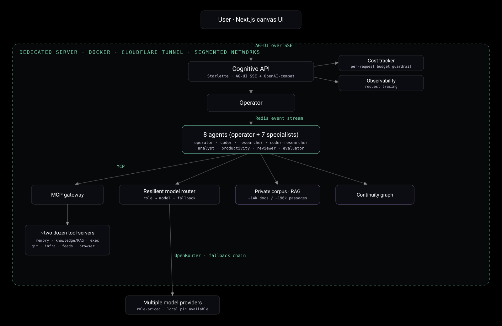

# Pacific Slate

Pacific Slate is the name I gave the system I built to organize my own work and information. Rather than rely on what Claude or ChatGPT provide out of the box, I wanted my material held somewhere private but still easy to reach. It runs on a rented server, a modest machine that hosts the services and holds encrypted backups of the files I care about.

I designed it, selected the parts, and run it day to day. Technical detail is in the collapsed sections at the bottom.

## What it does

- Keeps a current picture of the material I have connected to it.
- Runs scheduled jobs that produce a short brief, rather than waiting to be asked.
- Answers questions with the relevant background already loaded.
- Records what it decided not to raise, so the filtering can be checked.
- Connects to standard AI clients, so I use it from tools I already have.

## How a request is handled

Eight agents do the work: one that reads the request and routes it, and seven specialists for research, code, analysis, review, and related work. Each runs on a model chosen for that job, so a short lookup and a long analysis do not draw the same cost or wait on the same machinery.

Answers carry their sources, so a claim can be traced, and the cost of the call, so spending stays visible as it happens rather than at the end of the month.

## The interface

*The workspace, from the public demo. Answers arrive as cards that can be moved around rather than as one long thread, each labeled with the model used, the cost, and the time taken.*

**Demo: [pacslate.com/demo](https://pacslate.com/demo).** The real interface on sample data.

- **Canvas.** Enter a prompt or watch it run. [Open](https://pacslate.com/demo)
- **Monitor.** A dashboard. Seismic data and headlines are live, fetched in the browser; markets, aircraft, and anything personal are labeled sample data. [Open](https://pacslate.com/demo/#monitor)

## What is mine and what is rented

The parts that accumulate stay on my server. The model is rented.

![Where the data sits. What I connect, documents notes code and feeds, is ingested, de-duplicated, and screened for credentials and personal data, then held on my own server: the knowledge corpus, stored memory, tools, and the routing and spending limits. That material accumulates there and is exportable, deletable, and not used for training. Below it, across a labeled standard interface, is the rented model: the request goes out with context already loaded, and the answer returns with its sources and cost. Replacing the model is a configuration change, and nothing above it moves.](docs/who-owns-what.svg)

The model is the one part I do not control, so it is treated as replaceable. Substituting a better one is a configuration change.

What is stored is exportable and deletable, and is not used for training. Requests that go out reach only providers configured not to train on them or publish them ([account settings](docs/openrouter-privacy.png), June 2026). Where nothing should leave the server, work can be pointed at a model running on it.

I hold what accumulates, I decide where requests go, and none of it becomes a vendor's asset.

## Building it

I am an operator and systems architect by background, not a career software engineer. The architecture is mine: which components exist, how they connect, what each runs on, how it behaves when a part fails, and what it is allowed to spend. I built it AI-natively, specifying and reviewing while coding agents wrote most of the code.

It has run since early 2026 and I use it daily. Most of what the technical sections describe came out of operating it rather than planning it. The fallback layer exists because the framework's own fallback setting turned out to do nothing. The model label on every answer exists because a cost-driven substitution degraded output silently before I traced it.

---

# Technical detail

Model names on this page and in the example config are illustrative; the design is model-agnostic and the roster rotates. Counts are current as of August 2026 and were checked against the running system.

<strong>1 · Agents and memory</strong> · the design, not the assembly

**A designed multi-agent system, not a chat model with plugins.**

A multi-agent tree on **Google's Agent Development Kit (ADK)**: one operator at the root plus seven specialists (coder, researcher, analyst, productivity, reviewer, evaluator, and a research sub-agent scoped to the coder).

- **Cost and fit.** Each role maps to the model best suited and priced for its work.
- **Independent review.** The evaluator runs on a different model family than the agents whose output it scores. Different weights are not guaranteed different biases, but it beats self-scoring. The reviewer is a separate instance kept off the write path by policy.
- **Least privilege.** Tools are scoped per role by explicit allow-list. The researcher cannot reach infrastructure. The reviewer is read-only by charter. The productivity agent's credentials are isolated, so a failure there cannot take down the operator.
- **Containment.** A rate-limit or crash stays inside one specialist.
- ADK enforces a single-parent constraint on sub-agents, which is why the coder's research arm is a separate instance from the standalone researcher despite sharing a model and tools.
- Specialists publish findings to a **Redis event stream** that peers read as ambient context. Longer asynchronous jobs hand off to a background orchestrator rather than occupying the synchronous path.

**Model independence.** The substrate is exposed two ways: an **MCP gateway** (tools and memory over the Model Context Protocol, mountable by any MCP-capable client) and an **OpenAI-compatible endpoint**. Memory, data, tools, routing, and verification do not move when the model does.

**Memory, in four layers.**

| Layer | Function |
|---|---|
| Knowledge corpus | ~14,000 documents, ~196,000 passages. Hybrid retrieval: keyword plus vector similarity |
| Continuity graph | Links related conversations, decisions, and topics over time |
| Semantic memory | Durable facts for cross-session recall, with a nightly reconciliation and de-duplication job |
| Tiered context | Always-loaded core kept small; the rest retrieved on demand |

Two rules govern all of it. A deterministic relevance pass decides what to load before any model runs, with no model call. And recalled memory is treated as a lead rather than a fact: if memory says a vendor renews in July, the agent pulls the source document and acts on that.

**Proactive jobs.** Scheduled routines pull from many sources and score each candidate item for relevance, materiality, and novelty before it can enter a brief. Discarded items are logged rather than dropped silently, so the filter can be audited. A consolidation stage de-duplicates and normalizes before anything is stored, and screens for credentials and personal data on the way in.

**Operating principles.**

- **Algorithm first.** Default data access and classification to something deterministic: regex, an index, SQL, set membership. Use a model only for the irreducible part. The complexity scorer, the tool search, and the memory relevance pass are all applications of this.
- **Make failure visible, then cheap.** Each reliability fix pairs a guardrail with a trace, so the same class of problem cannot recur unseen.
- **Resilience over peak capability.** Where the two conflict, uptime wins.
- **Cost as a design constraint.** A real ceiling forces honest choices about model, context size, and when to use a model at all.

**See:** [`examples/model-routing.example.yaml`](examples/model-routing.example.yaml) for the routing structure · the model and cost label on each card in the [demo](https://pacslate.com/demo).

<strong>2 · Integration</strong> · models, tools, data, and interface as one system

**Model providers, tools, data, memory, and a frontend are integrated into one environment reachable over standard interfaces.**

Request path:

1. The canvas, a Next.js single-page app, opens a streaming connection and posts the prompt. Streaming uses the **AG-UI protocol over Server-Sent Events**, so tokens, tool calls, and model-resolution events arrive on one stream.
2. The backend is a **Starlette** service exposing the AG-UI endpoint for the canvas and an OpenAI-compatible endpoint for other clients.
3. The operator classifies the request and either answers inline or hands off to a specialist.
4. The specialist loads context and calls tools over MCP.
5. The **resilient model layer** resolves the model for that call, applies cost-aware downgrades and health-aware fallback (section 3), streams the completion, and meters cost.
6. The answer streams back as a card labeled with model and cost. Durable facts are written to memory.

Two speed tiers result: inline answers in a single model call, and delegated runs where a specialist works its own tool loop.

*System diagram. Click to enlarge.*

**Tool layer.** About two dozen tool-servers (memory, retrieval, code execution, git, feeds, infrastructure) behind one token-authenticated gateway, FastMCP over streamable HTTP, each server its own process.

- **Register, do not rewire.** New capability means registering a server. The cost is an extra hop and a single failure domain at the gateway, which is why the gateway has its own health check and the fleet is health-polled.
- **Search, do not load.** Carrying every tool schema in every agent's context is expensive and dilutes attention, so the gateway exposes a **BM25 search over the tool catalog**. The MCP specification only lists tools; this search is an addition.

| Layer | Choice |
|---|---|
| Agent framework | Google ADK, multi-agent tree |
| Backend | Starlette, AG-UI over SSE plus OpenAI-compatible endpoint |
| Frontend | Next.js, streaming result cards on a spatial canvas |
| Inter-agent bus | Redis event streams |
| Tooling | ~24 MCP servers behind one gateway, BM25 tool search |
| Operator | long-context model with native tool calling |
| Coder | code-specialized model, large context |
| Researcher | fast long-context model, single pass |
| Analyst | large mixture-of-experts reasoning model |
| Reviewer, evaluator | independent of the code-writers, scored on a different model family |
| Memory | hybrid-retrieval corpus, continuity graph, semantic memory, tiered context |
| Infrastructure | Docker, four segmented network tiers, Cloudflare Tunnel, sandboxed execution |
| Reliability | per-role fallback chains, health tracker, first-token watchdog, graceful degrade |
| Cost | per-request metering to a monthly ceiling, full call and swap tracing |

**See:** the diagram above · the [demo](https://pacslate.com/demo), which is the same canvas and protocol running against scripted events.

<strong>3 · Reliability and cost</strong> · the part that took the most iteration

**It stays up, stays within budget, and checks its own output, and each of those mechanisms is observable.**

**Cost control, applied before the call.** A deterministic scorer rates prompt complexity 1 to 5 from word count, keyword classes, code markers, role weight, and conversation depth, with no model involved. That score and current budget state select the tier:

| Monthly budget used | Behavior |
|---|---|
| Under 80% | Every role on its assigned model |
| 80 to 95% | Trivial tasks downgraded |
| 95 to 100% | All but essential high-complexity work downgraded |
| At 100% | Non-essential calls blocked |

Spend is tracked per request against a hard monthly ceiling, with atomic writes so the ledger survives a restart.

**Fallback.** In the ADK version I built on, the model wrapper called the provider directly and ignored the underlying library's fallback configuration, so that setting did nothing. I wrapped the model layer with one that implements it.

- A **health tracker** records rate-limited models and applies an **escalating cooldown** that grows with repeat offenses. Later calls skip a cooling-down model rather than hitting the same wall.
- A **time-to-first-token watchdog** bounds only the first response of an attempt. A model that stalls without emitting trips it and the call moves to the next model. Because nothing was yielded, there is no duplicate output. Once a stream starts it runs unbounded, with a longer outer timeout as backstop.
- A fallback model that cannot accept the tool definitions is skipped as a compatibility miss, not reported as a failure.
- If the chain is exhausted, the layer returns a message stating that specialist is unavailable rather than crashing the run group.

Chains terminate on different models per role, so no two roles share a last resort. Any workload can be pinned to a model on the server as a final option.

**A failure worth recording.** Agents intermittently produced worse output, with more hedging and occasional refusals, and nothing in the error logs. The cause was the cost router: under budget pressure it substituted a cheaper model, which returned success and behaved differently. The fix was to surface the substitution. Every swap now appears on the result card and in tracing, so the first question on a behavioral regression is which model served the call.

**See:** [`examples/model_fallback.py`](examples/model_fallback.py) for the fallback pattern, with the reasoning in the comments · [`examples/model-routing.example.yaml`](examples/model-routing.example.yaml) for budget structure.

<strong>4 · Operations and limits</strong> · deployment, and what this is not

**This runs as versioned, monitored infrastructure with a gated deployment path.**

- **Segmented.** Docker services across four network tiers (public-facing, internal, outbound, isolated sandbox) plus purpose-built networks, so the blast radius of one service is bounded. Ingress is through a Cloudflare Tunnel; the origin is not directly exposed.
- **Sandboxed execution.** Agent-run code executes in an isolated sandbox with an ephemeral workspace on its own network tier.
- **Gated deployment.** A push triggers pull, rebuild, health check, and a **build-provenance check that the running build matches what was deployed**, so a deploy that reported success without swapping the image is caught. A drift job reconciles configuration.
- **Maintenance.** A watchdog flags dependency and security updates. Low-risk ones merge through CI; the rest escalate.
- **Observability.** Spend attributed per request and per model. Every call and every model swap traced.

**Limits.**

- **Single operator, by design.** The reliability and privilege patterns are real mechanisms operating at personal scale. No claim is made about enterprise load, multi-tenancy, or an adversarial threat model.
- **One router in the path.** Hosted models are reached through a single gateway, so a router outage is a shared dependency. Pinning to the local model mitigates it; it does not remove it.
- **The demo is not connected.** Real interface, sample data, no link to the running system.
- **Semantic memory is a hosted service.** The one cloud dependency in an otherwise local stack. Swappable, and not the system of record.
- **Retrieval tuning is ongoing.** Hybrid retrieval covers more than keyword alone, but ranking is not a solved problem here.
- **Not a high-security design.** Serious about data control, not a threat model against a determined adversary.

**Rebuilding it.** This is a recipe to adapt, not a product to install. Point a coding agent at the architecture and rebuild the parts you want on what you already have. A working floor:

| Item | Cost |
|---|---|
| Coding assistant | ~$20/mo |
| Small server | ~$20/mo |
| Metered model calls, budget roster, personal load | $10-40/mo |

So roughly $50-80/mo, scaling up only where depth is wanted. My own build runs heavier because I develop it daily.

**Artifacts.**

- [`examples/model-routing.example.yaml`](examples/model-routing.example.yaml): the real config structure, with illustrative model IDs and figures.
- [`examples/model_fallback.py`](examples/model_fallback.py): the resilient-call pattern, simplified.

